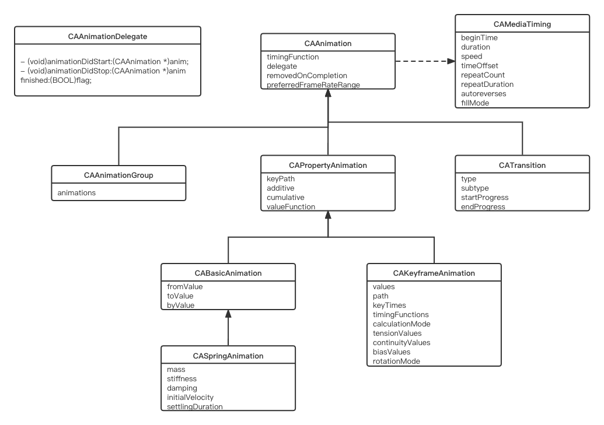

# CAAnimation常用类

| 类名                  | 类型       | 父类                  | 说明                       |
|:------------------- |:-------- | ------------------- |:------------------------ |
| CAMediaTiming       | protocol | nil                 | 定义动画时间相关属性               |
| CAAnimation         | class    | NSObject            | 抽象类，所有动画类型的基类，不可直接使用     |
| CAAnimationDelegate | protocol | nil                 | 动画开始和完成时的委托              |
| CAPropertyAnimation | class    | CAAnimation         | 抽象类，作为基础动画和帧动画的父类，不可直接使用 |
| CABasicAnimation    | class    | CAPropertyAnimation | 基础动画，用于实现单一属性变化的动画       |
| CAKeyframeAnimation | class    | CAPropertyAnimation | 帧动画，用于实现单一属性连续变化的动画      |
| CASpringAnimation   | class    | CABasicAnimation    | 弹簧动画，在基础动画的基础上添加弹簧效果     |
| CATransition        | class    | CAAnimation         | 过渡动画，可对非动画属性的变化添加过渡动画    |
| CAAnimationGroup    | class    | CAAnimation         | 动画组，用于实现多属性同时变化的动画       |

## CAAnimation常用类之间关系图

