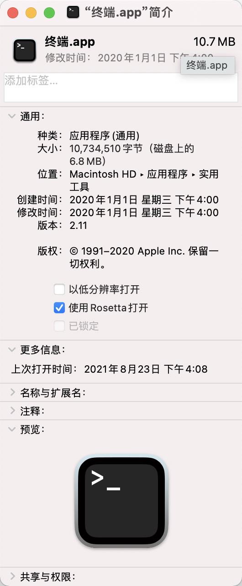

# M1芯片环境下pod install报错解决方案

1. 卸载原先的 `ffi` 

`sudo gem uninstall ffi` 

2. 修改终端设置

* 在访达中找到 `终端.app` ，位于 `应用程序 => 实用工具 => 终端.app` 

* 右键，显示简介

* 如下图，选中 "使用Rosetta打开" 选项

3. 再次安装 `ffi` 

`sudo gem install ffi` 

4. 再次执行 `pod install` ，问题解决