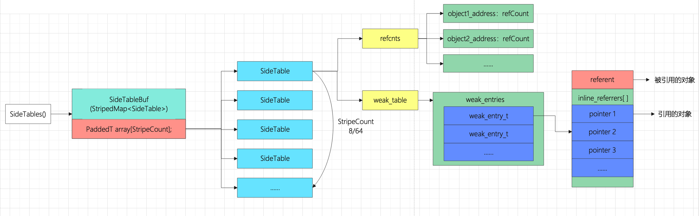

# 深入理解内存管理

> 参考自：[iOS：SideTable](https://blog.csdn.net/weixin_44060108/article/details/118149055) 、 [Objective-C runtime机制(7)](https://blog.csdn.net/u013378438/article/details/82790332)

关于 iOS 内存管理，在 runtime 中有四个数据结构是非常重要的，它们和对象的引用计数以及weak引用有关，分别是：

* SideTables
* SideTable
* weak_table_t
* weak_entry_t

## SideTables

```c++
static StripedMap<SideTable>& SideTables() {
    return *reinterpret_cast<StripedMap<SideTable>*>(SideTableBuf);
}
```

说明：

* `SideTables()` 使用 static 修饰，是一个静态函数
* `&` 表示返回引用类型

* `*reinterpret_cast` 是 C++ 强制类型转换语句，不用深究。
* 函数最终的结果就是返回 `SideTableBuf`

### SideTableBuf

```c++
// We cannot use a C++ static initializer to initialize SideTables because
// libc calls us before our C++ initializers run. We also don't want a global 
// pointer to this struct because of the extra indirection.
// Do it the hard way.
 
alignas(StripedMap<SideTable>) static uint8_t 
    SideTableBuf[sizeof(StripedMap<SideTable>)];
```

说明：

* `alignas` 表示对齐
* `StripedMap<SideTable>` 的 size 为 4096 （存疑，待验证）
* uint8_t 实际上是 unsigned char 类型，即占 1 个字节

由此可以得出结论，`SideTableBuf` 本质上是一个长度为 `sizeof(StripedMap<SideTable>)` 的 char 类型数组。或者可以理解为，`SideTableBuf` 本质上就是一个大小为 `sizeof(StripedMap<SideTable>)` 的内存块。

这也是为什么`SideTableBuf` 可以用来表示 `StripedMap<SideTable>` 对象。**本质而言，`SideTableBuf` 就是指一个 `StripedMap<SideTable>` 对象。**

### StripedMap\<SideTable\>

```c++
template<typename T>
class StripedMap {
#if TARGET_OS_IPHONE && !TARGET_OS_SIMULATOR
    enum { StripeCount = 8 };
#else
    enum { StripeCount = 64 };
#endif
 
    struct PaddedT {
        T value alignas(CacheLineSize);
    };
 
    PaddedT array[StripeCount];
 
    static unsigned int indexForPointer(const void *p) {
        uintptr_t addr = reinterpret_cast<uintptr_t>(p);
        return ((addr >> 4) ^ (addr >> 9)) % StripeCount;
    }
 
 public:
    T& operator[] (const void *p) { 
        return array[indexForPointer(p)].value; 
    }
    const T& operator[] (const void *p) const { 
        return const_cast<StripedMap<T>>(this)[p]; 
    }
    ...省略了对象方法...
}
```

说明：

* 根据是否为 iPhone 真机，确定 `StripeCount` 的数值。iPhone 真机上为8，其它为64.
* 使用 T 类型定义一个结构体，而 T 在这里就是 `SideTable` 类型。源码中 `CacheLineSize` 的大小为 64.
* 生成一个长度为8、类型为 `SideTable` 的数组。
* `indexForPointer()` 逻辑为根据传入的指针，经过一定的算法，计算出一个存储该指针的位置。由于使用了 `%` 取模运算，所以返回值的范围是 0 - StripeCount。即根据传入的指针地址，得到其对应于 `SideTable` 数组中的下标。
* 后面的 `operator` 表示重写了运算符 `[]` 的逻辑，调用了 `indexForPointer()` 方法，这样使用起来更像一个数组

### 小结

至此，我们做个小结。`SideTables` 返回 `SideTableBuf` 对象，而 `SideTableBuf` 本质上就是一个 `StripedMap<SideTable>` 对象。 `StripedMap<SideTable>` 内部又存在一个长度为8、类型为 `SideTable` 的数组。

**综上所述，SideTables 可以理解为一个静态全局 hash 表，内部以数组的形式存储了 StripeCount 个 SideTable。StripeCount 在 iPhone 下为8.**

**一些问题：**

SideTable 为什么要存在多个？

答：考虑到多线程和效率问题，必定不可能只使用一个 SideTable 来存储对象相关的引用计数器和弱引用。通过对 object 的地址进行运算之后，对 SideTable 的个数进行取模运算，以此来决定将对象分配到哪个 SideTable 进行信息存储，因为有取模运算，不会出现数组溢出的情况。

## SideTable

```objc
struct SideTable {
    spinlock_t slock; //自旋锁
    RefcountMap refcnts; //引用计数器Map
    weak_table_t weak_table; //弱引用表
 
    SideTable() {
        memset(&weak_table, 0, sizeof(weak_table));
    }
 
    ~SideTable() {
        _objc_fatal("Do not delete SideTable.");
    }
    ...省略对象方法...
}
```

可以看出，SideTable 有三个成员变量：

1. slock：自旋锁，负责加锁相关逻辑
2. refcnts：存储引用计数器的哈希表
3. weak_table：弱引用表

自旋锁暂不讨论。`refcnts` 可以理解为一个哈希表，使用键值对 `address:refcount` 的形式存储了很多个对象的引用计数器。`weak_table` 在后面会有详细介绍。

## weak_table_t

```c++
/**
 * The global weak references table. Stores object ids as keys,
 * and weak_entry_t structs as their values.
 */
struct weak_table_t {
    weak_entry_t *weak_entries; //hash数组，用来存储弱引用相关信息weak_entry_t
    size_t    num_entries; //hash数组中的元素个数
    uintptr_t mask; //hash数组长度减1，参与hash计算。注意，这里是hash数组长度而非元素个数。
    uintptr_t max_hash_displacement; //可能会发生的hash冲突的最大次数，用于判断是否出现逻辑错误
};
```

注释中说明，`weak_table_t` 是一个全局引用表，object 的地址作为 key，`weak_entry_t` 作为 Value。

`weak_table_t weak_table` 用来存储OC对象弱引用的相关信息。我们知道，`SideTables` 一共只有8/64个节点，而在我们的APP中，一般都会不只有8/64个对象。因此，多个对象一定会重用同一个 `SideTable` 节点，也就是说，一个 `weak_table` 会存储多个对象的弱引用信息。因此在一个 `SideTable` 中，又会通过 `weak_table` 作为hash表再次分散存储每一个对象的弱引用信息。

## weak_entry_t

```c++
/**
 * The internal structure stored in the weak references table. 
 * It maintains and stores
 * a hash set of weak references pointing to an object.
 * If out_of_line_ness != REFERRERS_OUT_OF_LINE then the set
 * is instead a small inline array.
 */
#define WEAK_INLINE_COUNT 4

// out_of_line_ness field overlaps with the low two bits of inline_referrers[1].
// inline_referrers[1] is a DisguisedPtr of a pointer-aligned address.
// The low two bits of a pointer-aligned DisguisedPtr will always be 0b00
// (disguised nil or 0x80..00) or 0b11 (any other address).
// Therefore out_of_line_ness == 0b10 is used to mark the out-of-line state.
#define REFERRERS_OUT_OF_LINE 2

struct weak_entry_t {
    DisguisedPtr<objc_object> referent; // 被弱引用的对象
    
    // 引用该对象的对象列表，联合。 引用个数小于4，用inline_referrers数组。 用个数大于4，用动态数组weak_referrer_t *referrers
    union {
        struct {
            weak_referrer_t *referrers;                      // 弱引用该对象的对象指针地址的hash数组
            uintptr_t        out_of_line_ness : 2;           // 是否使用动态hash数组标记位
            uintptr_t        num_refs : PTR_MINUS_2;         // hash数组中的元素个数
            uintptr_t        mask;                           // hash数组长度-1，会参与hash计算。（注意，这里是hash数组的长度，而不是元素个数。比如，数组长度可能是64，而元素个数仅存了2个）素个数）。
            uintptr_t        max_hash_displacement;          // 可能会发生的hash冲突的最大次数，用于判断是否出现了逻辑错误（hash表中的冲突次数绝不会超过改值）
        };
        struct {
            // out_of_line_ness field is low bits of inline_referrers[1]
            weak_referrer_t  inline_referrers[WEAK_INLINE_COUNT];
        };
    };

    bool out_of_line() {
        return (out_of_line_ness == REFERRERS_OUT_OF_LINE);
    }

    weak_entry_t& operator=(const weak_entry_t& other) {
        memcpy(this, &other, sizeof(other));
        return *this;
    }

    weak_entry_t(objc_object *newReferent, objc_object **newReferrer)
        : referent(newReferent) // 构造方法，里面初始化了静态数组
    {
        inline_referrers[0] = newReferrer;
        for (int i = 1; i < WEAK_INLINE_COUNT; i++) {
            inline_referrers[i] = nil;
        }
    }
};

```

`weak_table_t`中存储的元素是`weak_entry_t`类型，每个`weak_entry_t`类型对应了一个OC对象的弱引用信息。

说明：

* `DisguisedPtr<objc_object> referent` 为弱引用对象指针摘要。其实可以理解为弱引用对象的指针，只不过这里采用了摘要的形式存储。（摘要形式就是把地址取负）
* `union` 是一个联合，其中有两种形式：定长数组 `weak_referrer_t  inline_referrers[WEAK_INLINE_COUNT];` 和动态数组 `weak_referrer_t *referrers;` 。这两个数组是用来存储弱引用该对象的指针的指针的，同样也使用了指针摘要的形式存储。当弱引用该对象的指针数目小于等于 `WEAK_INLINE_COUNT` 时，使用定长数组。当超过 `WEAK_INLINE_COUNT` 时，会将定长数组中的元素转移到动态数组中，并之后都是用动态数组存储。

## 总结

`SideTables` 是一个静态全局函数，返回一个 `StripedMap<SideTable>` 类型的对象。 `StripedMap<SideTable>` 内部包含一个长度为 `StripeCount` 、类型为 `SideTable` 数组，并将其封装称hash表的形式。所以 `SideTables` 可以理解为一个全局的 hash 表，里面以数组的形式存放着多个 `SideTable` 对象。每个 `SideTable`  中都存放着 OC 对象的引用计数（recents）和弱引用表（weak_table）。`recents` 以 hash 表的形式存放着对象的引用计数信息，其中以对象的地址作为 Key、以引用计数器作为 Value。当对象的引用计数清零时，其键值对将会从对应的 `recents` 中删除。`weak_table` 中以 hash 数组的形式存放着多个 `weak_entry_t` 对象，每个 `weak_entry_t` 对象都对应着一个 OC 对象的弱引用信息。`weak_entry_t` 中记录着被引用的对象的指针，同时以数组的形式存放着所有弱引用该对象的指针的指针。当被弱引用的对象销毁时，所有弱引用该对象的指针将会被置空。

附：SideTables等数据结构关系图

