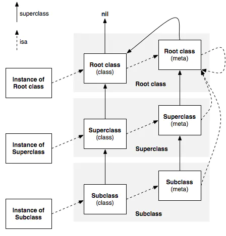

# Runtime之内存模型

## Class

```objc
typedef struct objc_class *Class;

struct objc_class {
    Class _Nonnull isa  OBJC_ISA_AVAILABILITY; //指向 metaclass

#if !__OBJC2__
    Class _Nullable super_class                              OBJC2_UNAVAILABLE; //父类
    const char * _Nonnull name                               OBJC2_UNAVAILABLE; //类名
    long version                                             OBJC2_UNAVAILABLE; //类的版本信息，默认为0
    long info                                                OBJC2_UNAVAILABLE; //供运行期间使用的一些标识为
    long instance_size                                       OBJC2_UNAVAILABLE;
    struct objc_ivar_list * _Nullable ivars                  OBJC2_UNAVAILABLE; //类的成员变量列表
    struct objc_method_list * _Nullable * _Nullable methodLists                    OBJC2_UNAVAILABLE; //类的方法列表
    struct objc_cache * _Nonnull cache                       OBJC2_UNAVAILABLE; //类的缓存列表
    struct objc_protocol_list * _Nullable protocols          OBJC2_UNAVAILABLE; //类遵循的协议列表
#endif

} OBJC2_UNAVAILABLE;
```

## MetaClass

> MetaClass 本质上就是 objc_class。Objective-C 为每个类的定义生成两个 objc_class，一个普通的类，一个就是 MetaClass。类对象中isa指针指向的类结构称为MetaClass，其中存放着static类型的成员变量与static类型的方法即类方法。

```objc
OBJC_EXPORT Class _Nullable
objc_getMetaClass(const char * _Nonnull name)
    OBJC_AVAILABLE(10.0, 2.0, 9.0, 1.0, 2.0);

OBJC_EXPORT BOOL
class_isMetaClass(Class _Nullable cls) 
    OBJC_AVAILABLE(10.5, 2.0, 9.0, 1.0, 2.0);
```

下图为class的 isa 指针和 super_class 指针的指向图：



isa 指针总结：

* 类的实例对象的 isa 指针指向它的类

* 类的 isa 指针指向该类的 metaclass

* metaclass 的 isa 指针指向根 metaclass

* 根 metaclass 的 isa 指针指向它自己

super_class 指针总结：

* 类的 super_class 指针指向它的父类
* 根类的 super_class 指针指向 null
* metaclass 的 super_class 指针指向父 metaclass
* 根 metaclass 的 super_class 指针指向其对应的类

## object

```objc
// 对象实质上就是一个isa指针
struct objc_object {
    Class _Nonnull isa  OBJC_ISA_AVAILABILITY;
};

typedef struct objc_object *id;
```

## Method

> 方法由方法名称（SEL）、方法类型（method_types）和方法实现（IMP）构成。
>
> SEL ，选择器，可以理解为一个字符串，同方法名之间存在一个映射关系。Objective-C 中，是通过SEL来识别方法，所以在同一个类中，不能存在方法名相同的方法，无论其参数类型和数量是否一致。
>
> method_types 包含方法的返回值和参数类型
>
> IMP，函数指针，指向方法的内存地址。

```objc
/// Method
typedef struct objc_method *Method;

struct objc_method {
    SEL _Nonnull method_name                                 OBJC2_UNAVAILABLE;
    char * _Nullable method_types                            OBJC2_UNAVAILABLE;
    IMP _Nonnull method_imp                                  OBJC2_UNAVAILABLE;
}

struct objc_method_list {
    struct objc_method_list * _Nullable obsolete             OBJC2_UNAVAILABLE;

    int method_count                                         OBJC2_UNAVAILABLE;
#ifdef __LP64__
    int space                                                OBJC2_UNAVAILABLE;
#endif
    /* variable length structure */
    struct objc_method method_list[1]                        OBJC2_UNAVAILABLE;
}

/// SEL
typedef struct objc_selector *SEL;

/// IMP
#if !OBJC_OLD_DISPATCH_PROTOTYPES
typedef void (*IMP)(void /* id, SEL, ... */ ); 
#else
typedef id _Nullable (*IMP)(id _Nonnull, SEL _Nonnull, ...); 
#endif
```

## 成员变量

```objc
typedef struct objc_ivar *Ivar;

struct objc_ivar {
    char * _Nullable ivar_name                               OBJC2_UNAVAILABLE;
    char * _Nullable ivar_type                               OBJC2_UNAVAILABLE;
    int ivar_offset                                          OBJC2_UNAVAILABLE;
#ifdef __LP64__
    int space                                                OBJC2_UNAVAILABLE;
#endif
}

struct objc_ivar_list {
    int ivar_count                                           OBJC2_UNAVAILABLE;
#ifdef __LP64__
    int space                                                OBJC2_UNAVAILABLE;
#endif
    /* variable length structure */
    struct objc_ivar ivar_list[1]                            OBJC2_UNAVAILABLE;
}
```

## Property

```objc
typedef struct objc_property *objc_property_t;
```

## Protocol

```objc
#ifdef __OBJC__
@class Protocol;
#else
typedef struct objc_object Protocol;
#endif

struct objc_protocol_list {
    struct objc_protocol_list * _Nullable next;
    long count;
    __unsafe_unretained Protocol * _Nullable list[1];
};
```

## Category

```objc
typedef struct objc_category *Category;

struct objc_category {
    char * _Nonnull category_name                            OBJC2_UNAVAILABLE; //分类名
    char * _Nonnull class_name                               OBJC2_UNAVAILABLE; //类名
    struct objc_method_list * _Nullable instance_methods     OBJC2_UNAVAILABLE; //分类的成员方法列表
    struct objc_method_list * _Nullable class_methods        OBJC2_UNAVAILABLE; //分类的类方法列表
    struct objc_protocol_list * _Nullable protocols          OBJC2_UNAVAILABLE; //分类遵循的协议列表
}
```

