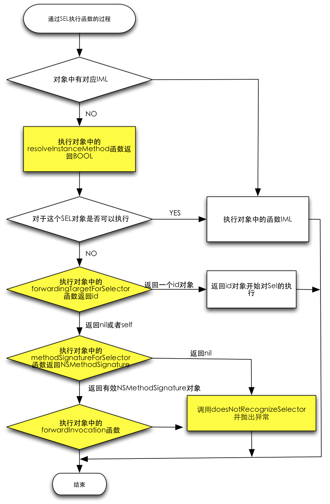

# iOS 消息转发机制

## 方法调用流程

oc 中的方法是通过 `SEL` 识别的，`SEL` 代表方法名称。所以在 oc 中，同一个类里面不能存在名称相同的方法，即使它们的参数类型不同。

当方法被调用时，首先会去当前类的缓存列表中查找，找到了则执行 imp 所指向的方法的具体实现。若未找到，则会去当前类的方法列表中查找，找到后执行。若找不到对应的方法实现，则会触发消息转发机制。

## 消息转发机制

oc 由于运行时特性，可以在运行期间动态添加方法，这个寻找动态添加的方法的过程就是动态消息转发。

iOS 的消息转发机制分为三个步骤：动态方法解析、快速消息转发机制和标准消息转发机制。

### 动态方法解析

首先，询问方法调用的接收者，查看其是否能动态添加调用的方法，来处理当前这个未知的 `SEL`.

对应的方法有 `+ (BOOL)resolveClassMethod:(SEL)sel` 处理类方法，`+ (BOOL)resolveInstanceMethod:(SEL)sel` 处理实例方法。

下面示例是实例方法的动态解析代码：

```objc
+ (BOOL)resolveInstanceMethod:(SEL)sel {
    if (sel == NSSelectorFromString(@"methodName")) {
      	// 利用 runtime 动态添加方法
        Method method = class_getInstanceMethod([self class], @selector(newMethod));
        IMP imp = method_getImplementation(method);
        const char * type = method_getTypeEncoding(method);
        return class_addMethod([self class], sel, imp, type);
    }
    return [super resolveInstanceMethod:sel];
}
```

### 快速消息转发

当动态方法解析未处理当前这个未知的 `SEL` 时，就会进入快速消息转发阶段，将消息转发给一个指定的目标对象进行处理。

该阶段调用 `- (id)forwardingTargetForSelector:(SEL)aSelector` 方法返回接收消息转发的目标对象。

下面为具体示例：

```objc
- (id)forwardingTargetForSelector:(SEL)aSelector {
    if (aSelector == NSSelectorFromString(@"methodName")) {
      	// 将消息转发给目标对象
    		return [[targetObj alloc] init];
    }
    return [super forwardingTargetForSelector:aSelector];
}
```

当快速消息转发阶段返回的目标对象为nil时，则会进入标准消息转发阶段。

### 标准消息转发

这是消息转发的最后一个阶段，首先会调用 `- (NSMethodSignature *)methodSignatureForSelector:(SEL)aSelector` 方法获得函数的参数和返回值。如果返回值为 nil ，runtime 则会发送 doesNotRecognizeSelector 消息，然后 crash；如果返回一个函数签名，runtime 就会创建一个 NSInvocation 对象，并传递给 `- (void)forwardInvocation:(NSInvocation *)anInvocation` 方法，将消息交给目标对象处理。

```objc
- (NSMethodSignature *)methodSignatureForSelector:(SEL)aSelector {
    if (aSelector == NSSelectorFromString(@"methodName")) {
        // 返回对应方法的签名信息
        return [NSMethodSignature signatureWithObjCTypes:"v@:"];
    }
    return [super methodSignatureForSelector:aSelector];
}

- (void)forwardInvocation:(NSInvocation *)anInvocation {
    if (anInvocation.selector == NSSelectorFromString(@"methodName")) {
      	// 交给目标对象处理
        TargetObj *targetObj = [[TargetObj alloc] init];
        anInvocation.target = targetObj;
        [anInvocation invoke];
        return;
    }
    [super forwardInvocation:anInvocation];
}
```

附：消息转发流程图


