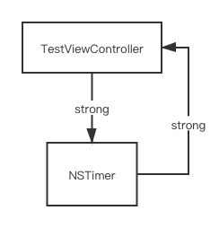
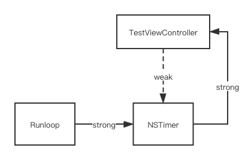
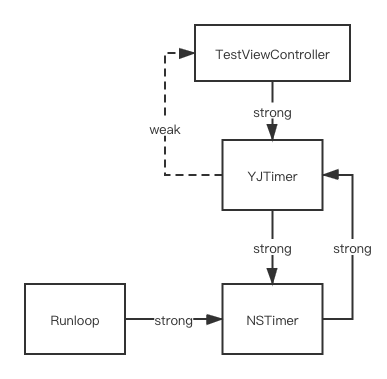

# 关于NSTimer内存泄漏问题

NSTimer是系统提供的计时器，在 iOS 开发过程中经常被使用到。NSTimer 相关API十分简单，但是使用起来却没那么容易，稍不注意，就很可能出现内存泄漏问题。

## 问题描述

```objective-c
@interface TestViewController ()
@property (nonatomic, strong) NSTimer *timer;
@end

@implementation TestViewController

- (void)viewDidLoad {
  [super viewDidLoad];
  
  NSTimer *timer = [NSTimer scheduledTimerWithTimeInterval:1.0 target:self selector:@selector(onTimerClock) userInfo:nil repeats:YES];
  [[NSRunLoop currentRunLoop] addTimer:timer forMode:NSRunLoopCommonModes];
  self.timer = timer;
}

- (void)onTimerClock {
  NSLog(@"onTimerClock");
}

- (void)dealloc {
  [self.timer invalidate];
  self.timer = nil;
}

@end
```

上述代码是 NSTimer 的一个常用场景，定义属性用来接收 NSTimer 实例，方便对其管理。然后在当前页面被销毁的时候，对 NSTimer 对象进行销毁。

运行代码，NSTimer 确实如预期每秒执行一次 `onTimerClock` 方法。但是，在退出控制器之后，发现 NSTimer 仍然在执行，控制台中可以看到仍旧每秒钟打印一次 `onTimerClock` ，并且当前控制器的 `dealloc` 方法未被调用。

分析原因，先看一下官方文档中对 `target` 参数的说明：

> target
>
> The object to which to send the message specified by `aSelector` when the timer fires. The timer maintains a strong reference to this object until it (the timer) is invalidated.

得到信息，**NSTimer 对 target 对象存在强引用，直到 NSTimer 被 invalidate。**



这里，我们将 NSTimer 的 target 设置为 self ，即 NSTimer 对当前对象强引用，而 NSTimer 本身又被当前对象的属性强引用。对象的引用关系如上图，这就出现了循环引用问题，导致当前视图无法正确释放，发生内存泄漏。

## 解决方案

### 方案一：使用 weak 修饰 NSTimer 属性（无效）

循环引用问题主要是因为当前对象对 NSTimer 强引用，同时 NSTimer 对当前对象也存在强引用。

机智如你，应该很快就能想到，如果我们将其中一方对另一方的强引用改成弱引用，循环引用问题不就解除了。

#### 1. 使用 weak 修饰 target

调整部分代码，如下：

```objective-c
__weak typeof(self) weakSelf = self;
NSTimer *timer = [NSTimer timerWithTimeInterval:1.0 target:weakSelf selector:@selector(onTimerClock) userInfo:nil repeats:YES];
[[NSRunLoop currentRunLoop] addTimer:timer forMode:NSRunLoopCommonModes];
self.timer = timer;
```

运行结果与之前一致，无效。

上面写法和直接使用 self 基本没有区别。

#### 2. 使用 weak 修饰 NSTimer

```objective-c
@interface TestViewController ()
@property (nonatomic, weak) NSTimer *timer;
@end
```

运行结果与之前一致，无效。

那么，问题究竟在哪呢？这里不是已经对 NSTimer 使用弱引用了吗？为什么还是存在循环引用？

我们都知道，NSTimer 只有被加到 Runloop 中才能被执行，否则不会执行。通过 `scheduledTimerWithTimeInterval` 方法创建的 NSTimer 会被自动添加到当前 Runloop 中。

我们看一下将 NSTimer 添加到 Runloop 的方法：

```objective-c
[[NSRunLoop currentRunLoop] addTimer:timer forMode:NSRunLoopCommonModes];
```

官方文档中有这样一段话：

> The receiver retains `aTimer`. To remove a timer from all run loop modes on which it is installed, send an [invalidate](apple-reference-documentation://ls%2Fdocumentation%2Ffoundation%2Fnstimer%2F1415405-invalidate) message to the timer.

Runloop 会持有 NSTimer，即对其强引用。

则，正确的引用关系应该如下图所示：



所以，就算使用 weak 来修饰 NSTimer 属性，NSTimer 还是不能被释放，因为 NSTimer 被 Runloop 强引用。

### 方案二：手动调用 NSTimer invalidate 方法

由官方文档可以得知，NSTimer 对 target 对象的强引用，会在 NSTimer invalidate 的时候被取消。

所以，我们可以在需要结束 NSTimer 的地方，调用 invalidate 方法，释放掉对当前对象的强引用，以此来打破循环引用。

该方案可以解决 NSTimer 的循环引用问题，但是在使用过程中需要我们手动来管理 NSTimer 的生命周期，需要注意页面退出之前有没有结束 NSTimer，并且在有些情况下使用不太合理。

比如，我们封装了一个 view 供他人使用，NSTimer 作为该 view 的属性。此时，NSTimer 应该何时结束？让调用者来管理 NSTimer 显然不合适，我们还是希望在 dealloc 中 NSTimer。

## 方案三：使用中间对象

定义一个类，该类包含一个 NSTimer 属性，并将 NSTimer 的 target 设置为该类的实例对象。

具体实现如下：

```objective-c
// YJTimer.h

@interface YJTimer : NSObject

@property (nonatomic, weak) id target;
@property (nonatomic, assign) SEL selector;

- (instancetype)initWithTimeInterval:(NSTimeInterval)interval target:(id)target selector:(SEL)selector repeats:(BOOL)repeats;
- (void)clearUp;

@end

// YJTimer.m
#import "YJTimer.h"

@interface YJTimer ()
@property (nonatomic, strong) NSTimer *timer;
@end

@implementation YJTimer

- (instancetype)initWithTimeInterval:(NSTimeInterval)interval target:(id)target selector:(SEL)selector repeats:(BOOL)repeats {
    self = [super init];
    if (self) {
        self.target = target;
        self.selector = selector;
        self.timer = [NSTimer scheduledTimerWithTimeInterval:interval target:self selector:selector userInfo:nil repeats:repeats];
    }
    return self;
}

- (id)forwardingTargetForSelector:(SEL)aSelector {
    if (aSelector == self.selector) {
        if (self.target) {
            return self.target;
        }
    }
    return [super forwardingTargetForSelector:aSelector];
}

- (void)clearUp {
    [self.timer invalidate];
    self.timer = nil;
}
@end
```

使用：

```objective-c
@interface TestViewController ()
@property (nonatomic, strong) YJTimer *yTimer;
@end

@implementation TestViewController

- (void)viewDidLoad {
  [super viewDidLoad];
  self.yTimer = [[YJTimer alloc] initWithTimeInterval:2.0 target:self selector:@selector(onTimerClock) repeats:YES];
}

- (void)onTimerClock {
  NSLog(@"onTimerClock");
}

- (void)dealloc {
  [self.yTimer clearUp];
}
```

分析上面代码：

我们自定义了一个 `YJTimer` 类来管理 NSTimer，NSTimer 的 target 设置为当前的 `YJTimer` 对象。

在实际使用过程中，我们只对 `YJTimer` 对象进行持有和使用，而 `YJTimer` 对象对当前视图是弱引用关系，所以不会影响到当前视图的释放。其引用关系如图：



此时，`YJTimer` 对象和其持有的 NSTimer 对象之间同样存在循环引用问题，我们希望在视图销毁时，结束 NSTimer，所以在视图对象的 dealloc方法中，调用 `YJTimer` 提供的 `clearUp` 方法，对 NSTimer 进行销毁，打破循环引用，这样 `YJTimer` 对象也会被释放，问题解决。
