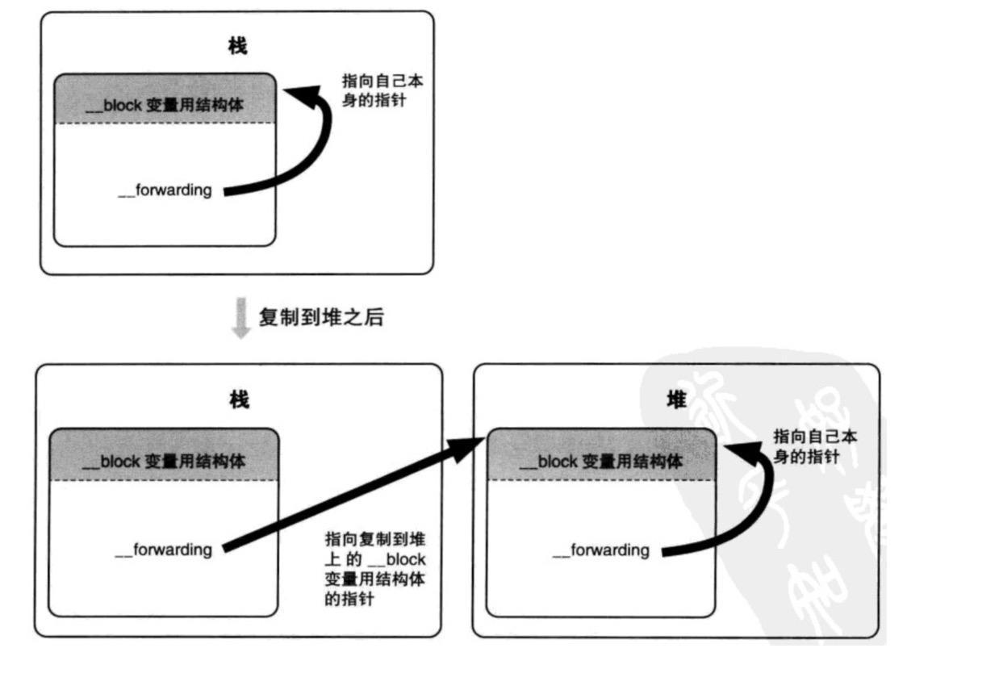

# __block实现原理

## 不使用__block

先来看一个例子：

```objective-c
/// main.m

#import <Foundation/Foundation.h>

typedef void(^MyBlock)(void);

int main(int argc, const char * argv[]) {
    int val = 10;
    MyBlock block = ^{
        NSLog(@"%d", val);
    };
    val = 20;
    block();
    return 0;
}
```

终端进入 `main.m` 所在文件夹，执行以下命令：

```
xcrun -sdk iphoneos clang -arch arm64 -rewrite-objc main.m
```

该命令会将 oc 代码转化成对应的 c++ 代码，转换后的代码如下（仅展示重要部分代码）：

```c++
typedef void(*MyBlock)(void);

struct __block_impl {
  void *isa; // 由此可见 block 底层也是 objc 对象
  int Flags;
  int Reserved;
  void *FuncPtr; // block 保存的函数指针
};

struct __main_block_impl_0 {
  struct __block_impl impl;
  struct __main_block_desc_0* Desc;
  int val; // block内部定义一个局部变量接受外部变量值
  
  // 构造函数
  __main_block_impl_0(void *fp, struct __main_block_desc_0 *desc, int _val, int flags=0) : val(_val) {
    impl.isa = &_NSConcreteStackBlock;
    impl.Flags = flags;
    impl.FuncPtr = fp;
    Desc = desc;
  }
};

static void __main_block_func_0(struct __main_block_impl_0 *__cself) {
  int val = __cself->val; // bound by copy
	NSLog((NSString *)&__NSConstantStringImpl__var_folders_kz_w914fv051x59q5glsn_q1g840000gn_T_main_57df4b_mi_0, val);
}

static struct __main_block_desc_0 {
  size_t reserved;
  size_t Block_size;
} __main_block_desc_0_DATA = { 0, sizeof(struct __main_block_impl_0)};

int main(int argc, const char * argv[]) {
    int val = 10;
    MyBlock block = ((void (*)())&__main_block_impl_0((void *)__main_block_func_0, &__main_block_desc_0_DATA, val));
    val = 20;
    ((void (*)(__block_impl *))((__block_impl *)block)->FuncPtr)((__block_impl *)block);
    return 0;
}
```

### 分析以上 c++ 代码

根据 `__block_impl` 的结构可知，block 的底层其实也是一个 objc 对象，并且在其中保存了对应的函数指针。

`__main_block_impl_0` 对应于某个特定 block 的定义。其中包含一个 `__block_impl` 结构类型对象，用于记录 block 相关信息。另外还包含一个 `__main_block_desc_0` 类型对象，用于记录 block 相关的描述信息，包括 block 大小等。`__main_block_impl_0` 内部还包含一个构造函数，在构造函数中完成对 `__block_impl` 和 `__main_block_desc_0` 的初始化。对于捕获的临时变量，`__main_block_impl_0` 内部会定义一个局部变量，用来捕获外部变量的值。注意，这里仅仅是一个值传递，外部变量的值传给内部变量后，在 block 则会使用内部变量进行后续操作，与外部变量没有直接关联。即，就算在 block 外部对变量值进行修改，block 内部的变量值也不会改变，始终为 block 定义时捕获到的外部变量值。**并且，在 block 中不能修改变量值，否则会出现编译报错。**

### 总结

不带 __block 的局部变量，被 block 捕获到内部时，为值传递，在 block 内部会生成一个临时变量来接收外部值并供 block 内部使用。并且，block 内部无法修改该值。

## 使用 __block

上代码：

```objective-c
/// main.m

#import <Foundation/Foundation.h>

typedef void(^MyBlock)(void);

int main(int argc, const char * argv[]) {
    __block int val = 10;
    MyBlock block = ^{
        val = 30;
        NSLog(@"%d", val);
    };
    val = 20;
    block();
    return 0;
}
```

转换成 c++ 代码：

```c++
typedef void(*MyBlock)(void);

struct __Block_byref_val_0 {
  void *__isa;
  __Block_byref_val_0 *__forwarding;
  int __flags;
  int __size;
  int val;
};

struct __main_block_impl_0 {
  struct __block_impl impl;
  struct __main_block_desc_0* Desc;
  __Block_byref_val_0 *val; // by ref
  __main_block_impl_0(void *fp, struct __main_block_desc_0 *desc, __Block_byref_val_0 *_val, int flags=0) : val(_val->__forwarding) {
    impl.isa = &_NSConcreteStackBlock;
    impl.Flags = flags;
    impl.FuncPtr = fp;
    Desc = desc;
  }
};

static void __main_block_func_0(struct __main_block_impl_0 *__cself) {
  __Block_byref_val_0 *val = __cself->val; // bound by ref
	(val->__forwarding->val) = 30;
  NSLog((NSString *)&__NSConstantStringImpl__var_folders_kz_w914fv051x59q5glsn_q1g840000gn_T_main_6e8413_mi_0, (val->__forwarding->val));
}

static void __main_block_copy_0(struct __main_block_impl_0*dst, struct __main_block_impl_0*src) {_Block_object_assign((void*)&dst->val, (void*)src->val, 8/*BLOCK_FIELD_IS_BYREF*/);}

static void __main_block_dispose_0(struct __main_block_impl_0*src) {_Block_object_dispose((void*)src->val, 8/*BLOCK_FIELD_IS_BYREF*/);}

static struct __main_block_desc_0 {
  size_t reserved;
  size_t Block_size;
  void (*copy)(struct __main_block_impl_0*, struct __main_block_impl_0*);
  void (*dispose)(struct __main_block_impl_0*);
} __main_block_desc_0_DATA = { 0, sizeof(struct __main_block_impl_0), __main_block_copy_0, __main_block_dispose_0};

int main(int argc, const char * argv[]) {
    __attribute__((__blocks__(byref))) __Block_byref_val_0 val = {(void*)0,(__Block_byref_val_0 *)&val, 0, sizeof(__Block_byref_val_0), 10};
    MyBlock block = ((void (*)())&__main_block_impl_0((void *)__main_block_func_0, &__main_block_desc_0_DATA, (__Block_byref_val_0 *)&val, 570425344));
    (val.__forwarding->val) = 20;
    ((void (*)(__block_impl *))((__block_impl *)block)->FuncPtr)((__block_impl *)block);
    return 0;
}
```

### 分析上面 c++ 代码

可见，添加了 `__block` 之后，原码中的 `__block int` 会被转换成一个 `__Block_byref_val_0` 类型的对象。block 内部也会定义一个 `__Block_byref_val_0` 类型的对象来引用外部对象。

再来看 `__Block_byref_val_0` ，`__Block_byref_val_0` 内部包含一个 isa 指针，说明其是一个 objc 对象。还包含一个指向 `_Block_byref_val_0` 类型的指针 `__forwarding`，该指针的作用后面再讲。另外，还将要捕获进 block 内部的局部变量的定义也放在了 `__Block_byref_val_0` 中。后续对局部变量的修改，也是通过 `_Block_byref_val_0` 对象来修改里面的变量值。

`__main_block_desc_0` 中也多了两个指针 `__main_block_copy_0` 和 `__main_block_dispose_0` ，这是和内存管理有关的函数。

### __forwarding 指针的作用？

在 [block详解](./基础篇-block详解.md) 这篇文章中，我们知道 block 根据其在内存中的存放位置不同，可以分为三种类型。其中栈上的 block 发生 copy 操作时，会被复制到堆内存上。

而 `__forwarding` 指针，就是为了当 block 位于不同内存位置时，都能访问到相应准确位置的变量。具体如下图：



### 总结

`__block` 修饰的变量，在底层会生成一个 struct 对象，并将该变量封装到对象内部。block 内部会定义一个同类型的 struct 对象指针，接收外部对象的地址。之后所有对局部变量的修改，都会通过调用 struct 对象内部的变量来实现。由于 block 内部接收的是外部对象的地址，所以其指向的内容与外部对象一致，在 block 内部的修改也会作用于外部对象。