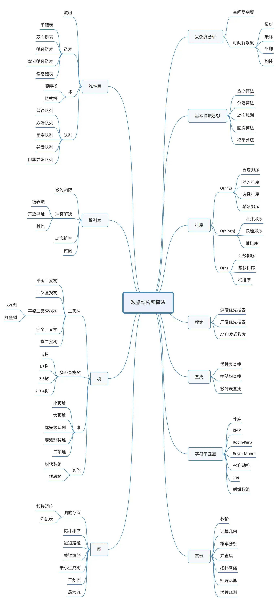

# 何谓数据结构与算法

从广义上讲，**数据结构就是指一组数据的存储结构。算法就是操作数据的一组方法。**

## 一、数据结构与算法之间的关系

数据结构和算法是相辅相成的。**数据结构是为算法服务的，算法要做用在特定的数据结构上。**

比如，数组具有随机访问的特性，常用的二分查找法需要用数组来存储数据。但如果选择链表这种数据结构来存储数据，二分查找算法就无法工作了，因为链表不支持随机访问。

数据结构是静态的，它只是组织数据的一种方式。如果不在它的基础上操作、构建算法，孤立存在的数据结构就是没用的。

## 二、数据结构与算法学习之路

### 1. 复杂度分析

### 2. 数据结构与算法知识点汇总

## 三、常见数据结构与算法

### 10个数据结构

1. 数组
2. 链表
3. 栈
4. 队列
5. 散列表
6. 二叉树
7. 堆
8. 跳表
9. 图
10. Trie 树

### 10个算法

1. 递归
2. 排序
3. 二分查找
4. 搜索
5. 哈希算法
6. 贪心算法
7. 分治算法
8. 回溯算法
9. 动态规划
10. 字符串匹配算法