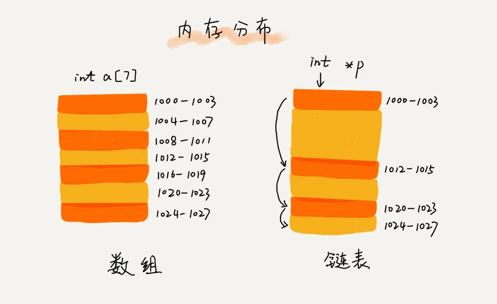

# 链表

链表与数组相似，也是一种线性表结构。但是它又与数组有很多不同，链表不需要连续的存储空间，它通过指针的形式，将一组零散的内存块串连起来使用。



## 1. 常见链表类型

### 1.1 单链表

单链表中的单个元素我们称之为**结点**，单个结点除了存储数据之外，还需要记录链表上下一个结点的地址，我们把记录下一个结点地址的指针称为**后继指针**。


链表中存在两个特殊结点，它们分别是第一个结点和最后一个结点，我们把第一个结点称为**头结点**，最后一个结点称为**尾结点**。

头结点用来记录链表的基地址，利用它可以遍历得到整条链表。

尾结点的指针不是指向下一个结点，而是指向一个空地址，表示这是链表上的最后一个结点。

### 1.2 循环链表

循环链表是一种特殊的单链表。它与单链表的唯一区别在于尾结点。单链表的尾结点指向空地址，而循环列表的尾结点指向链表的头结点。


循环链表的优点是从链尾到链头比较方便，常用来处理具有环形结构特点的数据。比如著名的**约瑟夫问题**。

### 1.3 双向链表

双向链表支持两个方向，每个结点不止有后继指针 next 指向后面的结点，还有一个前驱指针 prev 指向前面的结点。


双向链表较之于单链表会消耗更多的内存空间，因为它需要额外的一个指针来存储前驱结点的地址。但是双向链表在获取前驱结点的速度上远优于单链表。

### 1.4 链表与数组性能对比


## 实现双向链表

```swift
class Node<T> {
    var val: T
    weak var prev: Node?
    var next: Node?
    
    init(val: T) {
        self.val = val
    }
}

class NodeList<T> {
    fileprivate var head: Node<T>?
    private var tail: Node<T>?
    
    public func append(val: T) {
        let node = Node(val: val)
        if let tail = tail {
            node.prev = tail
            tail.next = node
        } else {
            head = node
        }
        
        tail = node
    }
}

extension NodeList: CustomStringConvertible {
    public var description: String {
        var text = "["
        var node = head
        while node != nil {
            text.append("\(node!.val)")
            node = node!.next
            if node != nil {
                text.append(", ")
            }
        }
        text.append("]")
        return text
    }
}

extension Node : CustomStringConvertible {
    public var description: String {
        return "\(val)"
    }
}

// 使用
let list = NodeList<Int>()
list.append(val: 1)
list.append(val: 2)
list.append(val: 3)
print(list.description)

```